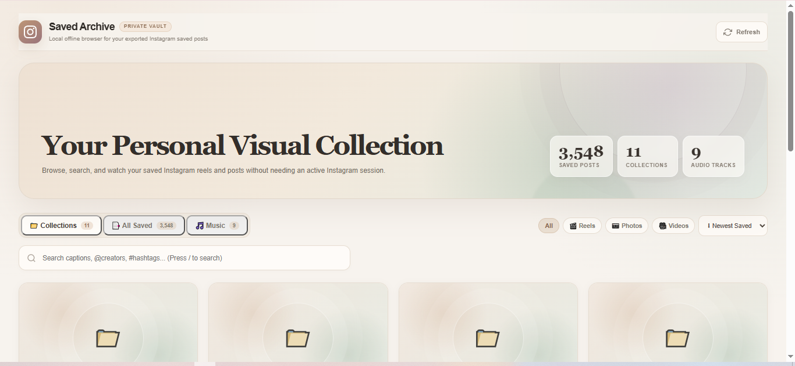

# Instagram Saved Library

### Delete Instagram without losing your saved posts & Reels.

**Turn your Instagram data export into a private, searchable visual library.**

---

---

## 🌐 Official Website

**[Visit Instagram Saved Library →](https://sthakur369.github.io/instagram-saved-library-site/)**

Instagram Saved Library is a local tool that reads the `saved` folder from an Instagram HTML data export and turns saved posts, Reels, collections and music into a visual, searchable library on your computer.

If you're thinking about deleting Instagram but don't want to lose years of saved content, this project is for you.

---

## Why Instagram Saved Library?

You may want to delete Instagram because you're tired of scrolling, distractions or simply don't want to use it anymore.

But you've probably saved years of:

- 📌 Useful posts
- 🎬 Reels and videos
- 🍳 Recipes
- ✈️ Travel ideas
- 💪 Workouts
- 🎨 Design inspiration
- 🛍️ Products
- 📁 Saved collections

So you request your Instagram data first.

Then you open the downloaded export and discover:

> **HTML files, links and data — not a normal saved-post library.**

That's the problem this project solves.

**Instagram Saved Library turns your Instagram data export into a visual, searchable library that stays on your computer.**

> **Leave Instagram. Keep what was worth saving.**

---

## What is this website?

This repository contains the **official website, landing page, SEO content and blog** for Instagram Saved Library.

The website explains:

- How to save your Instagram posts before deleting your account
- How Instagram's data export works
- How to view Instagram saved posts from an HTML export
- How to revisit saved Instagram Reels from an export
- How to browse Instagram saved collections from an export
- How to use Instagram Saved Library
- How to use the app with or without Python

New guides and articles are published in the **Blog** section.

---

## 🔍 Common questions

### How do I save Instagram posts before deleting my account?

Request your Instagram data export before deleting your account and include your **Saved items**. Instagram Saved Library can then organize the saved information from your export into a searchable local library.

### How do I view Instagram saved posts from an HTML export?

Instagram's data export can contain saved-post HTML files. Instagram Saved Library reads the exported saved data and presents it as a visual library instead of making you browse raw HTML.

### What do I do with my Instagram saved posts export?

After downloading your Instagram data, find the `saved` folder and use Instagram Saved Library to browse your exported saved posts, Reels and collections.

### Can I keep my saved Instagram Reels?

The app organizes the saved Reel/post information contained in your Instagram export so you can revisit the saved links from your local library.

### Can I search my Instagram saved posts?

Yes. The application provides search for captions, `@creators` and `#hashtags`.

### Can I keep my Instagram saved collections?

Yes. Saved collection information from the export can be browsed in the library.

### Do I need to upload my Instagram data?

No. The application is designed to run locally, so your exported Instagram files stay on your computer.

### Do I need Python?

Python is recommended for the easiest one-click experience, but the application also provides a browser-only mode for users who don't want to install Python.

---

# 🚀 Get the actual app

This repository contains the **website**, not the application itself.

The actual Instagram Saved Library application is maintained in the main repository:

### **[→ Instagram Saved Library — GitHub](https://github.com/sthakur369/instagram-saved-library-app)**

The application repository contains:

- Instagram saved-post library
- Saved Reels and video support
- Saved collections
- Saved music
- Search
- Quick View
- Pagination for large libraries
- Local operation
- Installation and usage instructions
- Source code and releases

**If you want to use the application, start here:**

**[Get Instagram Saved Library →](https://github.com/sthakur369/instagram-saved-library-app)**

---

## Contributing

Issues, improvements and pull requests are welcome.

---

## License

This project is licensed under the [MIT License](LICENSE).

**Built for people who want to leave Instagram without leaving their saved knowledge behind. ❤️**

